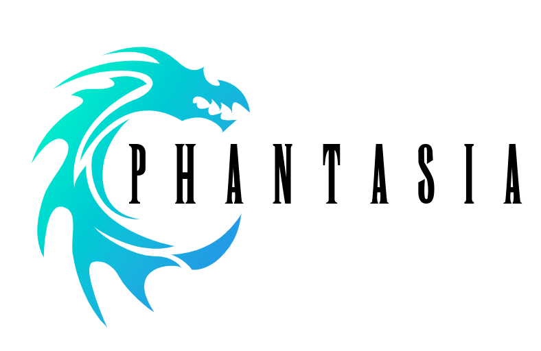
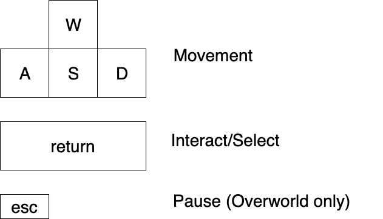

# Phantasia
Multiplatform Final Fantasy 1 port in Unity

## Installation
Download the repo as a zip file (green button at the top right). Open the "Builds" folder.
- Mac - Run Phantasia.app
- Windows - Run Phantasia.exe
- Linux - Run Phantasia.x86_64

## Button Layout

## Tips
- Pressing "m" on the title screen will switch between classic/remastered music. This will carry across sessions.

## What's Supported

### Overworld
- Corneria, Corneria Castle (Downstairs)
- Temple of Fiends
### Battling
- Actions
  - Fight
  - Run
- Classes
  - Fighter
  - Thief
  - Black Belt
  - Red Mage
  - White Mage
  - Black Mage
- Monsters
  - Bone
  - Creep
  - Ghoul
  - GrImp
  - GrWolf
  - Imp
  - MadPony
  - Spider
  - Wolf
  - WrWolf
  - Zombie
### Pause Menu
  - Orb Display
  - Gil Display
  - HP Display
  - Class Display
  - Lvl Display
### Misc
  - Title screen
  - Screen transitions
  - Enter/Exit battle
  - Music (Classic + remastered)
  - Collision
  - NPC Movement, Dialogue
  - Indoor rooms
  - All Overworld sprites
  - Buying items, weapons, armor, magic from shops. Equipping and learning magic not supported.
  - Saving + Healing at Inns
  - Earning gil upon battle win
  - Battle UI
  - Experience/Leveling system
